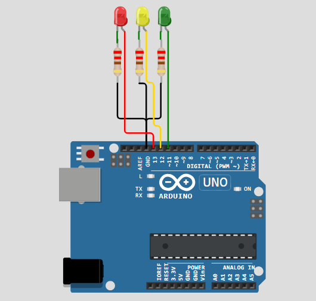

# 🚦 Smart Traffic Light Control System using Arduino

## 📌 Project Overview

This project simulates a traffic light control system using Arduino Uno and LEDs. The system automatically controls Red, Yellow, and Green signals based on predefined timing intervals.

## 🛠 Components Used

- Arduino Uno
- Red LED
- Yellow LED
- Green LED
- 220Ω Resistors
- Breadboard

## ⚙ Working

1. Green LED turns ON (Traffic Go)
2. Yellow LED turns ON (Traffic Slow)
3. Red LED turns ON (Traffic Stop)
4. Cycle repeats continuously

## 💻 Software Used

- Arduino IDE
- Wokwi Simulator
- Embedded C Programming

## 🎯 Applications

- Traffic Signal Automation
- Embedded Systems Learning
- Smart City Concepts
- IoT and AIoT Projects

## 📂 Project Files

- sketch.ino
- diagram.json

## 👩‍💻 Author

Vadapalli Srivalli Sravya

B.Tech ECE Student

Interested in Embedded Systems, AIoT.

## 🔗 Live Simulation

View the project on Wokwi:

https://wokwi.com/projects/465788032579984385

## 📷 Project Preview

